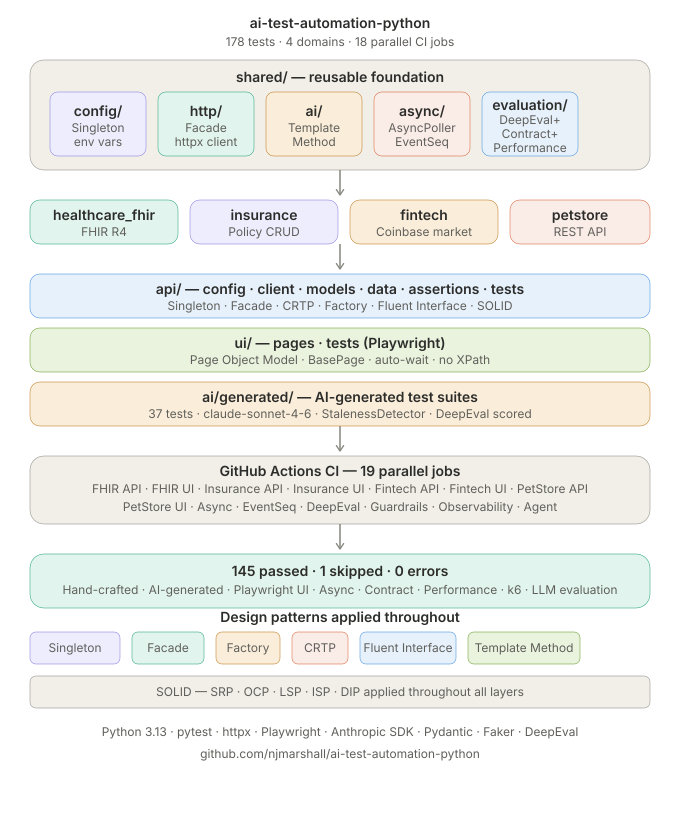

# AI Test Automation — Python

[](https://github.com/njmarshall/ai-test-automation-python/actions/workflows/ci.yml)
[](https://www.python.org/)
[](https://github.com/njmarshall/ai-test-automation-python)
[](https://github.com/njmarshall/ai-test-automation-python)
[](https://github.com/njmarshall/ai-test-automation-python/actions)

Production-grade AI-powered test automation framework across healthcare FHIR, insurance, fintech, and PetStore domains. Built with enterprise design patterns, AI test generation, self-healing agents, and a complete AI quality pipeline.

---

## Architecture



---

## The 4 AI Quality Pillars

This framework implements all four pillars required for production AI test automation:

| Pillar | Implementation | Location |
|---|---|---|
| Evaluation | DeepEval + ClaudeJudge scores AI-generated tests. Score below 0.7 = rejected | `shared/evaluation/` |
| Guardrails | InputGuard scrubs PHI before Claude. OutputGuard validates generated code safety | `shared/guardrails/` |
| Observability | AiObserver tracks cost, speed, quality drift on every Claude API call | `shared/observability/` |
| Orchestration | SelfHealingAgent connects all pillars into an autonomous repair loop | `shared/agent/` |

---

## Self-Healing Agent — Direction 1 Agentic Loop

When a test fails in CI, the SelfHealingAgent orchestrates all 4 pillars automatically:

```
CI Failure Detected
      ↓
Step 1: Read failing test file
Step 2: InputGuard scrubs PHI from fix prompt     ← Guardrails
Step 3: Claude generates the fix                  ← AI Generation
Step 4: OutputGuard validates generated code      ← Guardrails
Step 5: Human approval checkpoint                 ← Safety
Step 6: AiObserver records cost/speed/quality     ← Observability
      ↓
HealingResult — PASS or REJECTED
```

---

## Domain Coverage

| Project | API Tests | UI Tests | AI-Generated | Async Tests |
|---|---|---|---|---|
| healthcare_fhir | FHIR R4 Patient, Encounter, Observation | HAPI FHIR explorer (Playwright) | 10 tests | AsyncPoller + EventSequencer |
| insurance | Policy CRUD (JSONPlaceholder) | JSONPlaceholder docs (Playwright) | 12 tests | AsyncPoller |
| fintech | Coinbase market data, exchange rates, spot prices | Coinbase price page (Playwright) | 15 tests | AsyncPoller + EventSequencer |
| petstore | PetStore REST API (Swagger) | Swagger UI (Playwright) | planned | planned |

---

## Test Coverage

- **145 passed, 1 skipped** across all 4 domains
- **37 AI-generated tests** via Anthropic SDK (FHIR, Insurance, Fintech)
- **12 Playwright UI tests** across all 4 domains
- **17 parallel CI jobs** running on every push
- **7 self-healing agent tests** — mocked, fast, no API calls
- **3 performance baseline tests** — SLA assertions via httpx

---

## Async Polling Patterns

Reusable `AsyncPoller` and `EventSequencer` in `shared/async/` — built from real production experience:

| Strategy | Origin | Use Case |
|---|---|---|
| TimeoutStrategy | Finix payments | Poll until SUCCEEDED/FAILED within 15s SLA |
| FixedRetryStrategy | Indeed email delivery | Fixed retries for known pipeline stages |
| ExponentialBackoffStrategy | HEAVY.AI GPU cluster HA | Avoid thundering herd during recovery |
| EventSequencer | Indeed email pipeline | Validates event ORDER and COMPLETENESS |

---

## Performance Testing

Four-phase k6 performance suite for FHIR Patient API:

| Phase | File | Virtual Users | Duration | Purpose |
|---|---|---|---|---|
| Baseline | k6/baseline.js | 1 | 30s | Verify SLAs under no load |
| Load | k6/load.js | 10-50 | 2.5 mins | Normal clinical traffic |
| Stress | k6/stress.js | 50-200 | 3 mins | Find breaking point |
| Endurance | k6/endurance.js | 20 | 30 mins | Detect memory leaks |

Baseline results (HAPI FHIR sandbox):
- Average response time: 205ms
- p95 response time: 305ms
- Error rate: 0.00%
- All SLA thresholds passed

Run baseline:

```bash
k6 run shared/performance/k6/baseline.js
```

Key features:
- Correlation: Patient ID extracted and reused across CREATE, READ, DELETE
- Parameterization: randomized names, genders, unique identifiers per request
- Custom metrics: per-operation trends, error rates, active patient gauge
- SLA thresholds: CREATE < 3000ms, READ < 2000ms, DELETE < 2000ms

---

## AI Co-Pilot Workflow

```
Claude Chat    → Architecture decisions and design patterns
Claude Code    → Surgical fixes and automated test repair
InputGuard     → PHI scrubbing before every Claude API call
OutputGuard    → Code safety validation after every Claude response
AiObserver     → Cost, speed, quality metrics on every call
StalenessDetector → Flags stale tests before CI runs
```

---

## Shared Foundation

Every project inherits from `shared/` — add a new domain in hours, not weeks:

```
shared/
├── ai/            ← LLM layer — BaseTestGenerator (Template Method)
├── agent/         ← AI Agent — SelfHealingAgent (Orchestration)
├── async/         ← AsyncPoller + EventSequencer (Strategy)
├── evaluation/    ← DeepEval + ClaudeJudge (Evals)
├── guardrails/    ← InputGuard + OutputGuard (Safety)
├── observability/ ← AiObserver + drift detection (Monitoring)
├── config/        ← Singleton pattern
├── http/          ← Facade over httpx
├── assertions/    ← Fluent Interface validators
└── dataprovider/  ← Factory pattern test data
```

---

## Design Patterns

| Pattern | Applied In |
|---|---|
| Singleton | Config loaders — env vars loaded once per run |
| Facade | HTTP clients — tests never touch raw httpx |
| CRTP | Resource models — FhirResource[T], typed deserialisation |
| Factory | Test data — randomised, FHIR-compliant payloads |
| Template Method | AI generators — BaseTestGenerator skeleton |
| Fluent Interface | Validators — FhirValidator, InsuranceValidator, FintechValidator |
| Strategy | AsyncPoller — 3 interchangeable polling algorithms |
| Page Object Model | Playwright UI tests across all 4 domains |
| SOLID | Applied throughout all layers |

---

## Stack

```
Python 3.13 · pytest · httpx · Playwright · Anthropic SDK
Pydantic · Faker · DeepEval · pytest-rerunfailures
GitHub Actions · Allure Reports
```

---

## Published Articles

| # | Title | Topic |
|---|---|---|
| 1 | [How I Built a 73-Test AI-Powered Test Framework Across 4 Domains Using Claude](https://www.linkedin.com/pulse/how-i-built-73-test-ai-powered-test-framework-across-4-neil-marshall-oefac/) | Framework overview |
| 2 | [From Java to AI: Enterprise-Grade Test Framework Using TestNG, RestAssured, and Claude](https://www.linkedin.com/pulse/from-java-ai-how-i-built-enterprise-grade-test-using-testng-marshall-kaedc/) | Java framework |
| 3 | [Why Async Testing Is the Hardest Part of SDET Work and How I Solved It](https://www.linkedin.com/pulse/why-async-testing-hardest-part-sdet-work-how-i-solved-neil-marshall-9wbpc/) | AsyncPoller + EventSequencer |
| 4 | [AI Can Generate Tests. But Who Checks If They Are Any Good?](https://www.linkedin.com/pulse/ai-can-generate-tests-who-checks-any-good-neil-marshall-idibf/) | DeepEval evaluation |
| 5 | [The 4 Ideas Every AI Test Engineer Needs to Know in 2026](https://www.linkedin.com/pulse/4-ideas-every-ai-test-engineer-needs-know-2026-neil-marshall-agrnc/) | All 4 AI pillars |
| 6 | [How I Built PHI Guardrails Into My AI Test Pipeline](https://www.linkedin.com/pulse/how-i-built-phi-guardrails-my-ai-test-pipeline-neil-marshall-on6vc/) | Guardrails deep dive |
| 7 | [Async API Testing: 5 Failure Modes Most Test Suites Miss](https://www.linkedin.com/pulse/async-api-testing-5-failure-modes-most-test-suites-miss-neil-marshall/) | Async failure modes |
| 8 | [AI Quality Drift: How I Built AiObserver to Detect It Before Failure](https://www.linkedin.com/pulse/ai-quality-drift-how-i-built-aiobserver-detect-before-neil-marshall/) | Observability deep dive |

---

*Last updated: August 2026*
